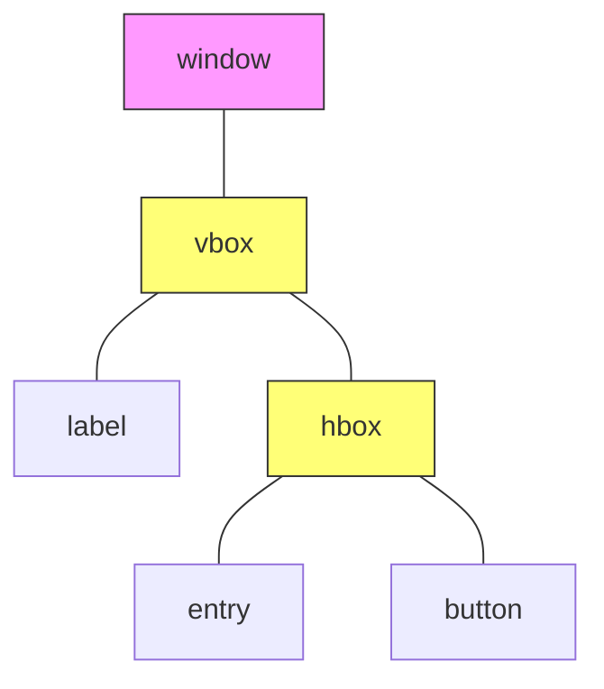

# Hello World

とりあえず、windowを表示してLabel、Buttonといったウィジェットや、コンテナであるBoxについて学ぶ。

## プロジェクトの作成と管理

まずバイナリクレートのプロジェクトを作成する。

```bash
$ cargo new hello_world --bin
```

Cargo.tomlに以下のように記述して場合コンパイルエラーが出た。

```TOML
[dependencies]
gtk = { version = "0.0.7", features = ["v3_10"] }
```

この方法ではなく、

```bash
$ cargo add gtk
```

として

```bash
$ cargo build
```

とすると無事ビルドに成功した。

## Windowを表示する

続いて作成したプロジェクトを編集してwindowに"Hello World"と表示させてみる。

`src/main.rs`
```Rust
extern crate gtk;
use gtk::prelude::*;

fn main() {
    gtk::init().expect("Failled to initialize GTK.");

    let window = gtk::Window::new(gtk::WindowType::Toplevel);

    window.set_title("Hello World");
    window.show_all();

    gtk::main();
}
```

これを
```bash
$ cargo run
```

としてwindowが表示されれた成功である。
このコードは`gtk::window`のインスタンスを生成し、`set_title()`でタイトルを追加、`show_all()`でwindowを表示してから`gtk::main()`でメインループに入る。

## ラベルウィジェット

先程のwindowにラベルを追加する。これを行うには、`gtk::Label`のインスタンスを生成し、`gtk::window`のインスタンスに追加すれば良い。

```Rust
fn main() {
    gtk::init().expect("Failled to initialize GTK.");

    let window = gtk::Window::new(gtk::WindowType::Toplevel);
    window.set_title("Hello World");

    let label = gtk::Label::new(Some("Hello, World"));
    window.add(&label);

    window.show_all();

    gtk::main();
}
```

## コンテナ 

ボタンを追加することを考えてみよう。

先程と同じように`gtk::Button`のインスタンスを生成して、それを`gtk::window`のインスタンスにaddする方法がまず思い浮かぶであろう。

```Rust

    let button = gtk::Button::with_label("Ok");
    window.add(&button);
```

しかし、これをビルド&実行するとwindowは表示されるが、エラーが出てボタンは表示されない。

```text
(hello_world:51796): Gtk-WARNING **: 15:28:26.428: Attempting to add a widget with type GtkButton to a GtkWindow, but as a GtkBin subclass a GtkWindow can only contain one widget at a time; it already contains a widget of type GtkLabel
```

このエラーを読むと、`GtkBin`のサブクラスである`GtkWindow`は一つのウィジェットしか含めることはできないためである。

このような場合では`Box`という`コンテナ`を用いるのが一般的である。
ここでGtk+ではWindowのような他のコンテナを持つことが可能なウィジェットのことをコンテナという。
`Box`ではコンテナを縦あるいは横に並べることが可能である。

```Rust
extern crate gtk;
use gtk::prelude::*;
use std::error::Error;

fn main() -> Result<(), Box<dyn Error>> {
    gtk::init()?;

    let window = gtk::Window::new(gtk::WindowType::Toplevel);
    window.set_title("Hello World");

    let hbox = gtk::Box::new(gtk::Orientation::Horizontal, 5);

    let label = gtk::Label::new(Some("Hello, World"));
    hbox.pack_start(&label, true, true, 5);

    let button = gtk::Button::with_label("Ok");
    hbox.pack_start(&button, false, false, 5);

    window.add(&hbox);
    window.show_all();

    gtk::main();
    Ok(())
}
```

BoxもコンテナであるためWindowと同様にadd()が可能であるが`pack_start()`,`pack_end()`の方が便利であるため良く用いられている。
なお、上のコードではエラー処理を`?`演算子で`main()`に譲渡している。

### コンテナのネスト

またコンテナはネストすることが可能である。

```Rust
extern crate gtk;
use gtk::prelude::*;
use std::error::Error;

fn main() -> Result<(), Box<dyn Error>> {
    gtk::init()?;

    let window = gtk::Window::new(gtk::WindowType::Toplevel);
    window.set_title("Hello World");

    let vbox = gtk::Box::new(gtk::Orientation::Horizontal, 5);

    let label = gtk::Label::new(Some("Hello, World"));
    vbox.pack_start(&label, false, false, 5);

    let hbox = gtk::Box::new(gtk::Orientation::Horizontal, 5);

    let entry = gtk::Entry::new();
    hbox.pack_start(&entry, false, false, 5);

    let button = gtk::Button::with_label("Ok");
    hbox.pack_start(&button, false, false, 5);

    vbox.pack_start(&hbox, true, true, 5);

    window.add(&vbox);
    window.show_all();

    gtk::main();
    Ok(())
}
```

上のコードでは、`vbox`というコンテナに`label`と、`hbox`のコンテナを入れていて、
`hobox`には`entry`,`button`が入っている。
下の図ではトップレベルのwindowはピンク色のノードで、コンテナBoxの`vbox`,`hbox`は黄色で示している。


